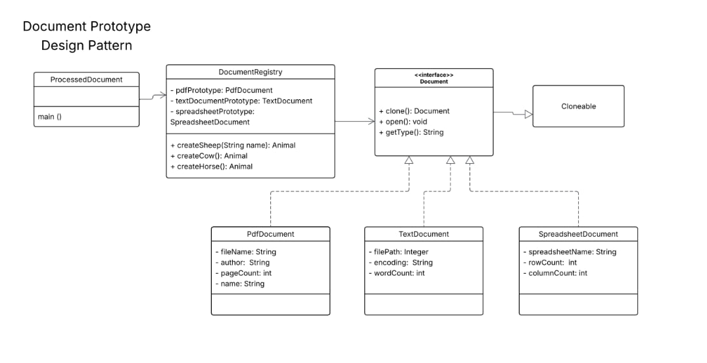

# Problem Statement: Document Prototype Management System

## Background
A software application needs to generate and process various types of documents, including PDFs, Text files, and Spreadsheets. Because instantiating these documents from scratch can be resource-intensive, the system must utilize the **Prototype Design Pattern**. Instead of creating new objects directly, the system will maintain a registry of pre-configured prototype documents and clone them whenever a new instance is needed.

## UML Diagram


## Task Requirements
You are required to implement the Prototype design pattern based on the provided UML diagram. 

### 1. Create the `Document` Interface:
* It must extend `Cloneable`.
* Include the following methods: `clone()`, `open()`, and `getType()`.

### 2. Implement Concrete Document Classes:
Create three classes that implement the `Document` interface. Each class must override the `clone()`, `open()`, and `getType()` methods, and include constructors, getters, and setters for their respective private attributes:
* **`PdfDocument`**: Attributes include `fileName` (String), `author` (String), `pageCount` (int), and `name` (String).
* **`TextDocument`**: Attributes include `filePath` (String), `encoding` (String), and `wordCount` (int). *(Note: Implement `filePath` as a String rather than an Integer for practical functionality).*
* **`SpreadsheetDocument`**: Attributes include `spreadsheetName` (String), `rowCount` (int), and `columnCount` (int).

### 3. Implement the `DocumentRegistry` Class:
* Maintain private attributes for the prototypes of each document type (`pdfPrototype`, `textDocumentPrototype`, `spreadsheetPrototype`).
* In the constructor, initialize these prototypes with default data and print a confirmation message for each creation (see Expected Output).
* Implement methods to fetch cloned instances of each document type (e.g., `createPdfDocument()`, `createTextDocument()`, `createSpreadsheetDocument()`).

### 4. Implement the `ProcessedDocument` (Main) Class:
* Instantiate the `DocumentRegistry`.
* Retrieve cloned instances of the PDF, Text, and Spreadsheet prototypes.
* Call the `open()` method on each, followed by a print statement detailing their specific attributes.
* Retrieve a *second* cloned instance of the PDF prototype, modify its `fileName` and `pageCount`, and call `open()` on it.


## Expected Output
Your program must produce the exact output below. Ensure there are proper line breaks between the output blocks.

```text
Creating a PDF Document prototype.
Creating a Text Document prototype.
Creating a Spreadsheet Document prototype.

Opening PDF Document: annual_report_2024.pdf by Acme Corp (150 pages)
Type: PDF, File: annual_report_2024.pdf, Author: Acme Corp, Pages: 150

Opening Text Document: meeting_notes.txt with encoding: UTF-8 (250 words)
Type: Text, Path: meeting_notes.txt, Encoding: UTF-8, Words: 250

Opening Spreadsheet Document: sales_data_q1.xlsx (1000 rows, 20 columns)
Type: Spreadsheet, Name: sales_data_q1.xlsx, Rows: 1000, Columns: 20

Opening PDF Document: summary_report.pdf by Acme Corp (30 pages)
